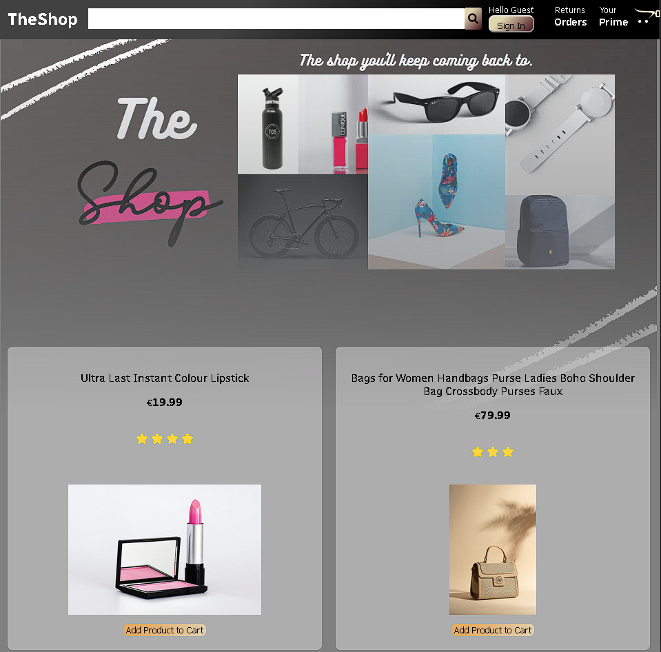

<div id="top"></div>

[![LinkedIn][linkedin-shield]](www.linkedin/in/omarzeinhom)

<!-- PROJECT LOGO -->
<br />

<div align="center">
<kbd>
    
    </kbd>

  <a href="https://github.com/omarashzeinhom/theshop-amazon-insipred-shop">
  </a>

  <h3 align="center"></h3>

  <p align="center">
The Shop- a full ecommerce website built utilizing React.Js and firebase
You need to add a firebase auth and firestore database for it to display data and work if youd like to see the demo please click on the demo
    <br />
    <br />
    <br />
    <a href="https://th3shop-8d8a3.web.app/">View Demo</a>
    ·
    <a href="https://github.com/omarashzeinhom/theshop-amazon-insipred-shop/issues">Report Bug</a>
    ·
    <a href="https://github.com/omarashzeinhom/theshop-amazon-insipred-shop/issues">Request Feature</a>
  </p>
</div>

<!-- TABLE OF CONTENTS -->
<details>
  <summary>Table of Contents</summary>
  <ol>
    <li>
      <a href="#about-the-project">About The Project</a>
      <ul>
        <li><a href="#built-with">Built With</a></li>
      </ul>
    </li>
    <li>
      <a href="#getting-started">Getting Started</a>
      <ul>
        <li><a href="#prerequisites">Prerequisites</a></li>
        <li><a href="#installation">Installation</a></li>
      </ul>
    </li>
    <li><a href="#usage">Usage</a></li>
    <li><a href="#roadmap">Roadmap</a></li>
    <li><a href="#contributing">Contributing</a></li>
    <li><a href="#license">License</a></li>
    <li><a href="#contact">Contact</a></li>
    <li><a href="#acknowledgments">Acknowledgments</a></li>
    <li><a href="#references">References</a></li>

  </ol>
</details>

<!-- ABOUT THE PROJECT -->

## About The Project

[![Product Name Screen Shot][product-screenshot]](https://oa-gaming-blog.vercel.app/)

This is a graphcms blog , that uses api interface for authentication with next js , it has no database however the users are stored on the graphql api graphcms.

Use the `BLANK_README.md` to get started.

<p align="right">(<a href="#top">back to top</a>)</p>

### Built With

This section should list any major frameworks/libraries used to bootstrap your project. Leave any add-ons/plugins for the acknowledgements section. Here are a few examples.

- [Next.js](https://nextjs.org/)
- [React.js](https://reactjs.org/)
- [NextAuth.js](https://next-auth.js.org/)

### Requirements

- [yarn](https://yarnpkg.com/)
- [react-icons](https://yarnpkg.com/package/react-icons)
- [react-currency-format](https://www.npmjs.com/package/react-currency-format)
- [firebase](https://yarnpkg.com/package/firebase)
- [firebase-tools](https://yarnpkg.com/package/firebase-tools)

<p align="right">(<a href="#top">back to top</a>)</p>

<!-- GETTING STARTED -->

## Getting Started

### Prerequisites

- npm
  ```sh
  npm install npm@latest -g
  ```

### Installation

1. Get the free API Key's at
   FireBase: [https://firebase.google.com/](https://firebase.google.com/)
2. Clone the repo
   ```sh
   git clone https://github.com/omarashzeinhom/gaming-graphcms-blog-auth
   ```
3. Install NPM packages
   ```sh
   yarn install
   ```
4. Enter your API Keys from new Firebase auth and Firestore in `/src/firebase.js`

   ```
   apiKey: 'ENTER YOUR API',
   authDomain: 'ENTER YOUR API',
   projectId:'ENTER YOUR API',
   storageBucket: 'ENTER YOUR API',
   messagingSenderId: 'ENTER YOUR API',
   appId: 'ENTER YOUR API',
   measurementId: 'ENTER YOUR API'
   ```

   ```

   ```

<p align="right"><a href="#top">back to top</a>)</p>

<!-- USAGE EXAMPLES -->

## Usage

<p align="right">(<a href="#top">back to top</a>)</p>

<!-- ROADMAP -->

## Roadmap

- [x] Add Changelog
- [x] Add back to top links
- [x] Add Additional Templates w/ Examples
- [ ] Add "components" document to easily copy & paste sections of the readme

See the [open issues](https://github.com/omarashzeinhom/gaming-graphcms-blog-auth/issues) for a full list of proposed features (and known issues).

<p align="right">(<a href="#top">back to top</a>)</p>

<!-- CONTRIBUTING -->

## Contributing

Contributions are what make the open source community such an amazing place to learn, inspire, and create. Any contributions you make are **greatly appreciated**.

If you have a suggestion that would make this better, please fork the repo and create a pull request. You can also simply open an issue with the tag "enhancement".
Don't forget to give the project a star! Thanks again!

1. Fork the Project
2. Create your Feature Branch (`git checkout -b feature/AmazingFeature`)
3. Commit your Changes (`git commit -m 'Add some AmazingFeature'`)
4. Push to the Branch (`git push origin feature/AmazingFeature`)
5. Open a Pull Request

<p align="right">(<a href="#top">back to top</a>)</p>

<!-- LICENSE -->

## License

Distributed under the MIT License. See `LICENSE.txt` for more information.

<p align="right">(<a href="#top">back to top</a>)</p>

<!-- CONTACT -->

## Contact

Project Link: [https://github.com/omarashzeinhom/gaming-graphcms-blog-auth](https://github.com/omarashzeinhom/gaming-graphcms-blog-auth)

<p align="right">(<a href="#top">back to top</a>)</p>

<!-- ACKNOWLEDGMENTS -->

## Acknowledgments

- [GitHub Pages](https://pages.github.com)
- [Google Fonts](https://fonts.google.com/)
- [React Icons](https://react-icons.github.io/react-icons/search)
- [FireBase](https://firebase.google.com/)

<p align="right">(<a href="#top">back to top</a>)</p>

### References

1.[https://www.youtube.com/watch?v=RDV3Z1KCBvo](https://www.youtube.com/watch?v=RDV3Z1KCBvo)

<!-- MARKDOWN LINKS & IMAGES -->
<!-- https://www.markdownguide.org/basic-syntax/#reference-style-links -->

[forks-shield]: https://img.shields.io/github/forks/othneildrew/Best-README-Template.svg?style=for-the-badge
[forks-url]: https://github.com/omarashzeinhom/gaming-graphcms-blog-auth/network/members
[linkedin-shield]: https://img.shields.io/badge/-LinkedIn-black.svg?style=for-the-badge&logo=linkedin&colorB=555
[linkedin-url]: https://www.linkedin.com/in/omar-abdelrahman-7602a9126/?challengeId=AQEV9iEfbhe5gAAAAX-mimK5NgF_ZhhgsWKnBK9_zqyaTZckcCE79DjQV-8dXVQnAYfVBYBjqhTy_kV030w0LcR3fKRVV8IgyQ&submissionId=02a9350a-f50a-de16-1a87-3ca3b148e71a
[product-screenshot]: img/gaming-blog-screen-shot.jpg
